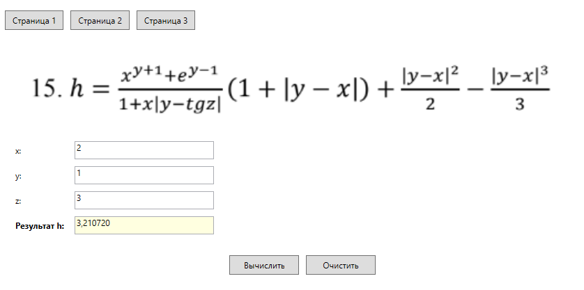
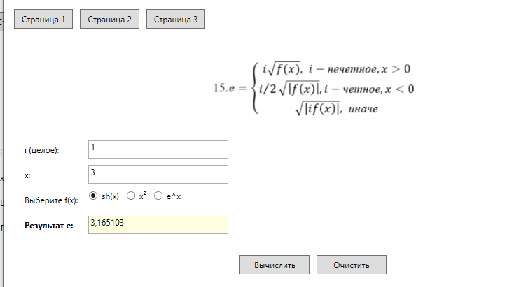
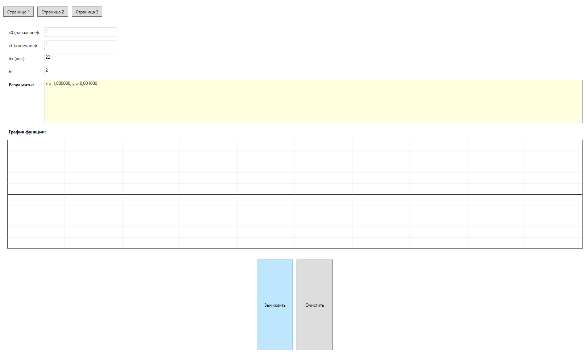

# pr4 (pr4cch1)

## Возможности

-   Функция 1 (например: ввод данных с клавиатуры)
-   Функция 2 (например: вычисление сложного процента)
-   Функция 3 (например: вывод результата в табличном виде)

##  Технологии

-   **Язык:** C# 
-   **Фреймворк:** .NET (версию можно уточнить в файле `.csproj`)
-   **Среда:** Visual Studio Code
-   **Тип приложения:** WPF 

## Вид работы программы

